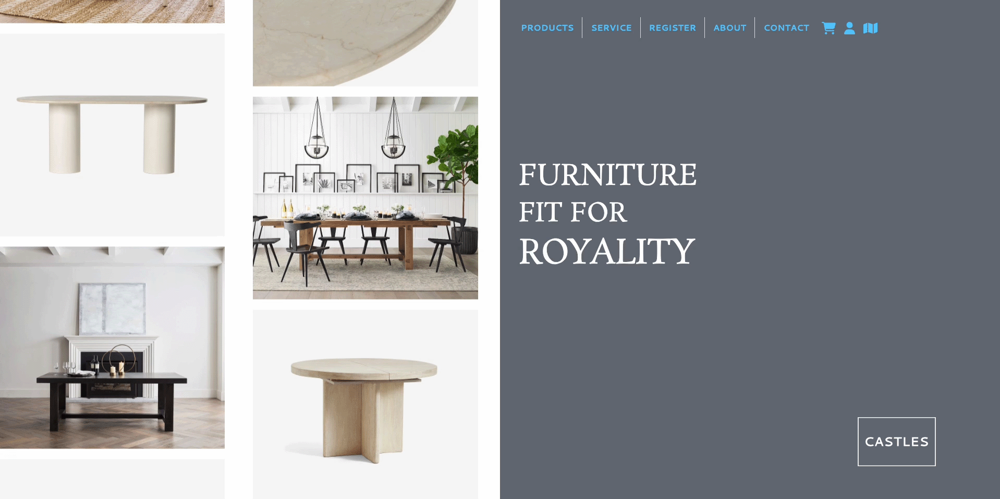

# Elvis Canastuj Puac
- **Email:** 21elvisc@gmail.com
- **LinkedIn:** [linkedin.com/in/elvis-canastuj-53116625b](https://www.linkedin.com/in/elvis-canastuj-53116625b)

## Objective

Eager to leverage hands-on experience in full-stack development to contribute effectively to a dynamic programming team and expand my knowledge through continuous learning.

## Skills & Projects

- **Languages:** English, Spanish
- **Programming Languages:** HTML, CSS, JavaScript, Python, Java, SQL
- **Frameworks/Libraries:** Bootstrap, React
- **Software:** Office 365 Suite, Adobe Photoshop, Adobe Illustrator, Adobe Dreamweaver

### Projects

#### GitPost'n (Full-Stack Collaboration Platform)
- Developed a collaborative platform for code sharing, project collaboration, and tech discussions.
- Technologies Used: JavaScript, HTML, CSS, Bootstrap, Bootswatch, MySQL, Node.js.
- Integrated MicroBlogLite API and utilized GitHub for seamless collaboration.

#### Enjoy The Outdoors (Dynamic Web Experiences)
- Demonstrated proficiency in JavaScript, HTML, and CSS by creating dynamic web experiences with filtering options for parks and mountains pages.

#### Diary+ (Python Desktop Application)
- Designed and implemented a user-friendly Python desktop application for efficient diary entry management using Tkinter.
- Utilized dynamic arrays for organizing entries and implemented robust file handling functionalities.

#### Castles Ecomerece Website

